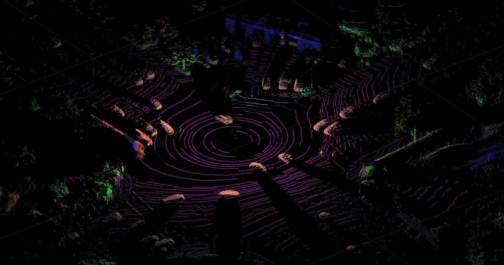
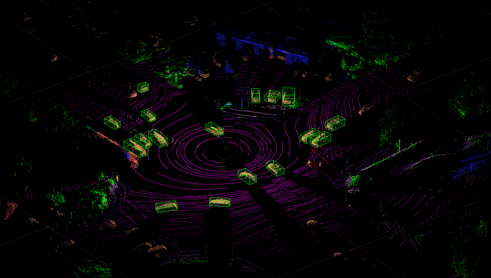
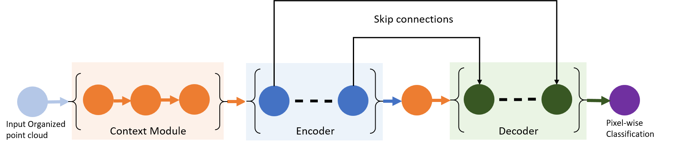

# SalsaNext For Lidar Segmentation

This repository provides a pretrained SalsaNext[1] segmentation model in MATLAB&reg;.

[](https://matlab.mathworks.com/open/github/v1?repo=matlab-deep-learning/pretrained-salsanext)

Requirements
------------

- MATLAB R2021a or later.
- Deep Learning Toolbox&trade;
- Lidar Toolbox&trade;

Overview
--------

This repository provides the SalsaNext network trained to segment different object categories including road, cars, trucks, etc. This pretrained model is trained using Pandaset dataset[2] which has 13 different object categories. This repository works on organized point clouds, if you have unorganized or raw point clouds refer the [Unorganized to Organized Conversion of Point Clouds Using Spherical Projection example](https://in.mathworks.com/help/lidar/ug/unorgaized-to-organized-pointcloud-conversion.html) to convert into organized point clouds. 

SalsaNext is the popular Lidar semantic segmentation network used for segmentation of 3-D point clouds. SalsaNext was build upon SalsaNet that has encoder-decoder architecture with residual dilated convolution stack with gradually increasing receptive fields for encoder and a pixel-shuffle layer was added as upsampling layer in the decoder.

Getting Started
---------------
Download or clone this repository to your machine and open in MATLAB.

### Download the pretrained network
Use below helper to download the pretrained network. The network will be downloaded and saved in `model` directory.

```
model = helper.downloadPretrainedSalsaNext; 
net = model.net;
```

### Semantic Segmentation Using Pretrained SalsaNext

```
% Read test point cloud.
ptCloud = pcread('pointclouds/0001.pcd');

% Convert point cloud to 5-channel image.
I = helper.pointCloudToImage(ptCloud);

% Segment objects from the test point cloud.
predictedResult = semanticseg(I, net);

% Display the output.
op = single(predictedResult);
cmap = helper.lidarColorMap();
colormap = cmap(op,:);
ptCloudMod = pointCloud(reshape(I(:,:,1:3),[],3),"Color",colormap);
figure
pcshow(ptCloudMod);
```


Video output generated on test sequence.

 

### Generate 3-D bounding boxes from segmentation result
The segmentation result is transformed to cuboid by clustering the points from class of interest and fitting cuboid around it. For more information about how to detect and track objects using lidar data, see [Detect, Classify, and Track Vehicles Using Lidar Example](https://www.mathworks.com/help/lidar/ug/detect-classify-and-track-vehicles-using-lidar.html).

```
% Get the indices of points for the required class.
carIdx = (predictedResult == 'Car');

% Select the points of required class and cluster them based on distance.
ptCldMod = select(ptCloud,carIdx);
[labels,numClusters] = pcsegdist(ptCldMod,0.5);

% Select each cluster and fit a cuboid to each cluster.
bboxes = [];
for num = 1:numClusters
    labelIdx = (labels == num);
    
    % Ignore cluster that has points less than 200 points.
    if sum(labelIdx,'all') < 200
        continue;
    end
    pcSeg = select(ptCldMod,labelIdx);
    try
        mdl = pcfitcuboid(pcSeg);
        bboxes = [bboxes;mdl.Parameters];
    catch
        continue;
    end
end

% Display the output.
figure;
ax = pcshow(ptCloudMod);
showShape('cuboid',bboxes,'Parent',ax,'Opacity',0.1,...
          'Color','green','LineWidth',0.5);
```



Training Custom SalsaNext Using Transfer Learning
-------------------------------------------------

Transfer learning enables you to adapt a pretrained SalsaNext network to your dataset. Create a custom SalsaNext network for transfer learning with a new set of classes using the `salsaNextTransferLearn.m` script.


Code Generation for SalsaNext
-----------------------------
Code generation enables you to generate code and deploy SalsaNext on multiple embedded platforms.

Run `codegenSalsaNext.m`. This script calls the `salsaNextpredict.m` entry point function and generate CUDA code for it. It will run the generated MEX and gives output.

| Model | Inference Speed (FPS) | 
| ------ | ------ | 
| SalsaNext w/o codegen | 8.06 |
| SalsaNet with codegen | 24.39 |

- Performance (in FPS) is measured on a TITAN-RTX GPU.

For more information about codegen, see [Deep Learning with GPU Coder](https://www.mathworks.com/help/gpucoder/gpucoder-deep-learning.html).

## SalsaNext Architecture Details
The SalsaNext network architecture is illustrated in the following diagram.



- **Context Module:** To aggregate the global context information in different regions, a residual dilated convolution stack is used. This module fuses a larger receptive field with a smaller one by adding 1x1 and 3x3 kernels right at the beginning of the network. This module captures the global context alongside with more detailed spatial information.

- **Encoder:** The encoder block consists of a novel combination of a set of dilated convolutions having effective receptive fields of 3, 5 and 7. Each dilated convolution output is concatenated and then passed through a 1×1 convolution followed by a residual connection. This helps the network exploit more information from the fused features coming from various depths in the receptive field. Each of these new residual dilated convolution blocks is followed by dropout and pooling layers.

- **Decoder:** In general transpose convolutions are used in decoders which are computationally expensive. These standard transpose convolutions are replaced with the pixelshuffle layers, which leverages on the learnt feature maps to produce the upsampled feature maps by shuffling the pixels from the channel dimension to the spatial dimension.


References
----------

[1] Cortinhal, Tiago, George Tzelepis, and Eren Erdal Aksoy. “SalsaNext: Fast, Uncertainty-Aware Semantic Segmentation of LiDAR Point Clouds for Autonomous Driving.” ArXiv:2003.03653 [Cs], July 9, 2020. http://arxiv.org/abs/2003.03653.

[2] [Panda Set](https://scale.com/open-datasets/pandaset) is provided by Hesai and Scale under the [CC-BY-4.0 license](https://creativecommons.org/licenses/by/4.0)


Copyright 2021 The Mathworks, Inc.
